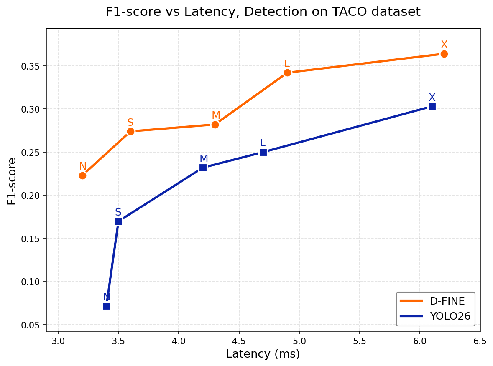
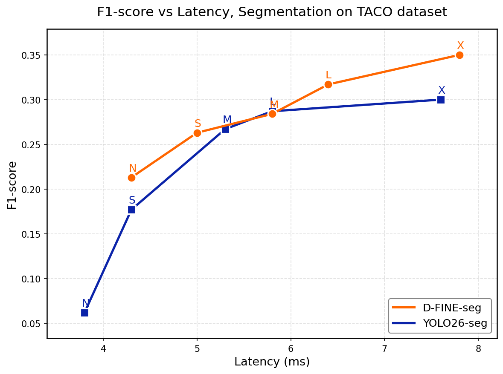
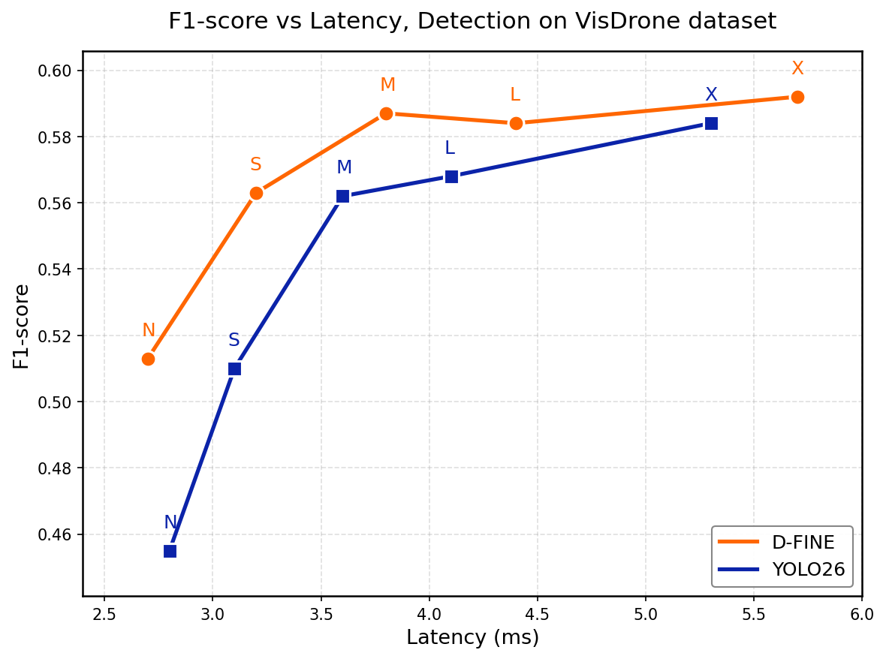
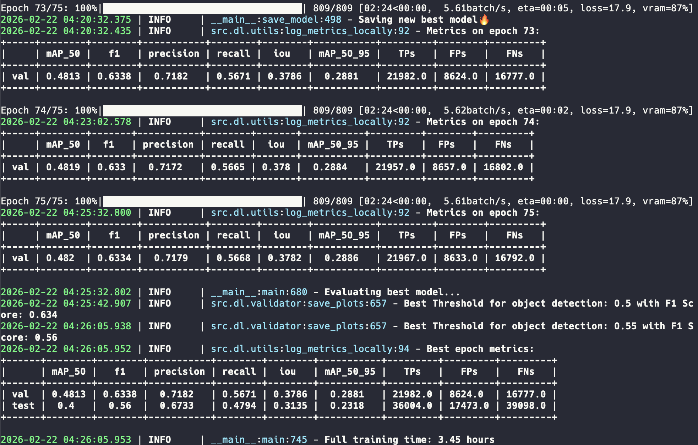
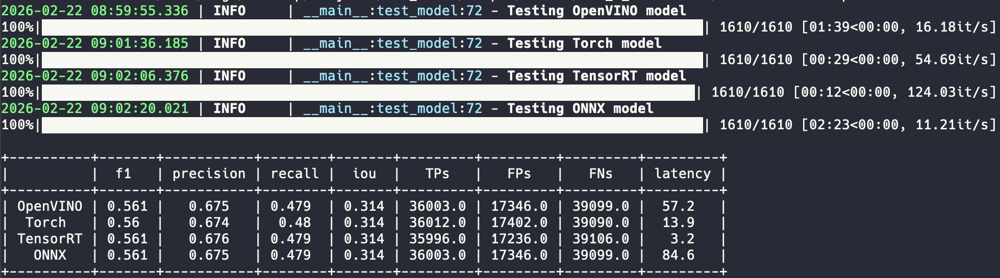
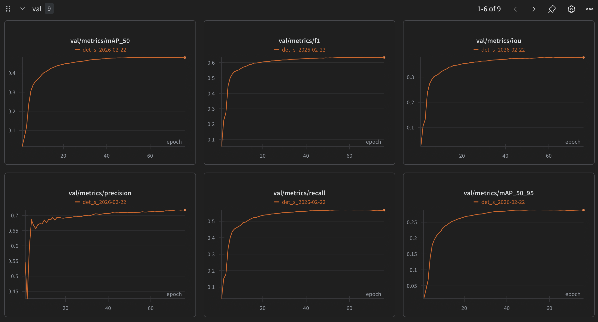
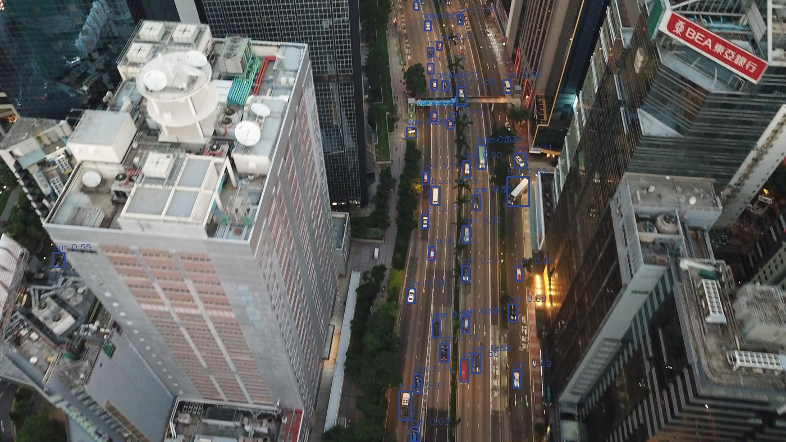
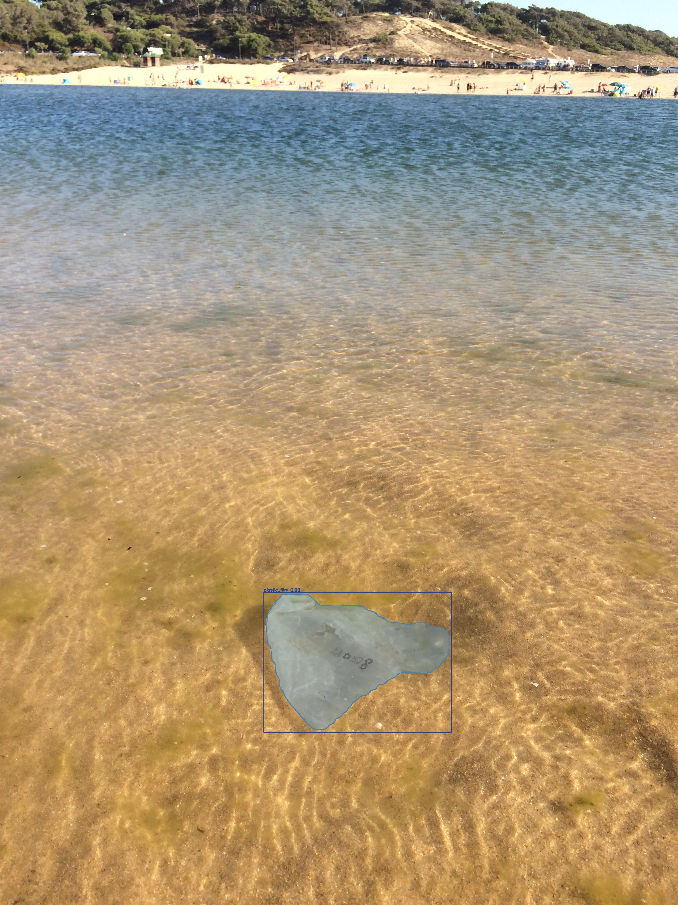

<p align="center">
  <h1 align="center">D-FINE-seg</h1>
  <p align="center">
    <strong>Real-Time Object Detection and Instance Segmentation</strong>
  </p>
  <p align="center">
    <a href="#quick-start">Quick Start</a> •
    <a href="#usage">Usage</a> •
    <a href="#export">Export</a> •
    <a href="#inference">Inference</a> •
    <a href="#benchmarks">Benchmarks</a> •
    <a href="https://youtu.be/_uEyRRw4miY">Video Tutorial</a> •
    <a href="https://colab.research.google.com/drive/1ZV12qnUQMpC0g3j-0G-tYhmmdM98a41X?usp=sharing">Colab</a>
  </p>
</p>

<p align="center">
  <a href="https://arxiv.org/abs/2602.23043"></a>
  <a href="https://huggingface.co/ArgoSA/D-FINE-seg"></a>
  <a href="LICENSE"></a>
  <a href="mailto:argo.cve@gmail.com"></a>
</p>

---

**D-FINE-seg** extends the [D-FINE](https://arxiv.org/abs/2410.13842) real-time transformer based object detector with instance segmentation. It adds a lightweight mask head, segmentation-aware training (box-cropped BCE and dice mask losses, auxiliary and denoising mask supervision), and mask-aware Hungarian matching. On the TACO and VisDrone datasets, D-FINE-seg improves F1-score over Ultralytics YOLO26 under a unified TensorRT FP16 end-to-end benchmarking protocol, while maintaining competitive latency.

The framework covers the full workflow — from data preparation and training (with DDP, EMA, AMP, mosaic) through export (ONNX, TensorRT, OpenVINO, CoreML, LiteRT) to optimized multi-backend inference for both **object detection** and **instance segmentation** tasks.

This is **not** a fork. The detection core is based on the [original D-FINE paper](https://github.com/Peterande/D-FINE); everything else — segmentation head, training pipeline, export, inference, augmentations — was reimplemented from scratch.

> [**Paper**](https://arxiv.org/abs/2602.23043): *D-FINE-seg: Object Detection and Instance Segmentation Framework with Multi-Backend Deployment*

## Highlights

- **Instance segmentation** via a lightweight mask head on top of D-FINE's HybridEncoder PAN outputs — fuses stride 8/16/32 features to 1/4 resolution, then dot-product between per-query mask embeddings (3-layer MLP) and shared mask features produces per-instance masks
- **New losses**: box-cropped BCE + Dice mask losses computed only inside GT boxes and normalized by ROI area
- **Mask-aware denoising**: contrastive denoising training extended with mask supervision for faster convergence (adds no inference cost)
- **Mask-aware matching**: Hungarian matcher augmented with Dice overlap cost and sigmoid focal mask cost alongside classification, L1, and GIoU costs
- **5 model sizes** — Nano, Small, Medium, Large, Extra-Large — with HGNetv2 backbones
- **Production-ready**: export to ONNX / TensorRT / OpenVINO / CoreML / LiteRT and optimized inference backends

<p align="center">
  
  
</p>

## Quick Start

### Installation

```bash
git clone https://github.com/ArgoHA/D-FINE-seg.git
cd D-FINE-seg
uv sync
```

This creates a `.venv/` with all dependencies pinned by `uv.lock`. Activate it with `source .venv/bin/activate`, or run anything via `uv run ...` (the Makefile already does this).

Pretrained weights are auto-downloaded from [Hugging Face](https://huggingface.co/ArgoSA/D-FINE-seg) into `pretrained/` on first use, so no manual setup is needed. To download manually instead, grab `dfine_<size>_<dataset>.pt` (size ∈ {n, s, m, l, x}, dataset ∈ {coco, obj2coco}) and place it in `pretrained/`. Segmentation weights are also availible in the Hugging Face model card.

### Prepare Your Data

Two annotation formats are supported: **YOLO** (default) and **COCO JSON**.

#### YOLO format (default)

``` bash
data/dataset/
├── images/    # all images: .jpg, .png, etc. (.npy for multi-channel — see below)
└── labels/    # all labels: one .txt per image (same filename stem)
```

**Detection labels**: `class_id xc yc w h` (normalized)

**Segmentation labels**: `class_id x1 y1 x2 y2 ... xN yN` (normalized polygon coordinates)

**Input types & channel order**: 3-channel `.jpg`/`.png` (BGR, read via `cv2.imread`), 3-channel `.npy` (RGB, read via `np.load`), or 4-channel `.npy` (RGB+extras, e.g. RGB+thermal).

#### Multi-channel inputs (RGB + thermal / depth / NIR / …)

Set `train.in_channels: N` (default 3) to train on stacks beyond plain RGB.
Supported range is `N=3` (RGB) or `N=4` (RGB + one extra modality, e.g. thermal,
depth, NIR). Higher channel counts are not supported — cv2 / Albumentations
ops cap at 4.

Layout is the same; drop the stacks as **`.npy`** files (uint8 HWC arrays):

``` bash
data/dataset/
├── images/    # one .npy per sample, shape (H, W, N), dtype uint8
└── labels/    # YOLO .txt (same as 3-channel case)
```

Loader rules (see [src/dl/dataset.py](src/dl/dataset.py)):

- `np.load` is byte-faithful — channels come back exactly as you saved them.
- A file whose channel count doesn't match `train.in_channels` is skipped with a `loguru.warning` line (path + reason). Mosaic re-samples another index automatically.
- Pretrained 3-channel backbone weights are reused: the stem conv is *inflated* to N input channels by tiling/averaging the RGB filters (`inflate_stem_weight` in [src/d_fine/utils.py](src/d_fine/utils.py)), so fine-tuning from COCO still works.
- Stem freeze (`freeze_at` in [src/d_fine/configs.py](src/d_fine/configs.py)) is auto-bypassed when `in_channels > 3` so the inflated extra-channel weights can train; the size-configured `freeze_at` still applies for plain 3-channel RGB.

Channel-order convention: write the RGB triplet in the first three planes
(channels `0..2`) so they line up with the pretrained RGB stem; extra
modalities go in channels `3..N-1`. Example for RGB + thermal: stack as
`[R, G, B, T]`.

Example: [src/etl/m3fd_to_yolo.py](src/etl/m3fd_to_yolo.py) converts the [M3FD](https://github.com/JinyuanLiu-CV/TarDAL) RGB+thermal detection benchmark (PASCAL VOC XML + paired `Vis/`/`Ir/` PNGs) into this exact layout.

#### COCO JSON format

Place standard COCO JSON annotation files alongside your images folder. Splits are detected automatically by filename:

``` bash
data/dataset/
├── images/       # all images
├── train.json    # COCO-format annotations for train split
├── val.json      # COCO-format annotations for val split
└── test.json     # (optional) COCO-format annotations for test split
```

Enable COCO mode by setting `coco_dataset: True` in your config (see below). No CSV split generation step is needed — the splits are read directly from the JSON files.

### Configure

Edit `config.yaml` — key settings:

```yaml
task: detect  # "detect" or "segment"
exp_name: my_exp  # experiment name (used in output paths)
model_name: s  # n / s / m / l / x

train:
  root: /path/to/project  # project root, will be used for outputs
  data_path: /path/to/dataset  # folder with images/ and labels/ (YOLO) or *.json files (COCO)
  coco_dataset: False  # set True to use COCO JSON annotations (train.json / val.json / test.json)
  label_to_name:
    0: class_a
    1: class_b
  epochs: 75
  batch_size: 8
  img_size: [640, 640]  # (h, w)
```

### Usage

```bash
make split           # create train/val CSV splits (test split if configured)
make train           # train the model
make export          # export to ONNX, TensorRT, OpenVINO, CoreML, LiteRT
make bench           # benchmark all exported models on the val set

make infer           # run on test folder, save visualizations + YOLO txt predictions
make check_errors    # compare predictions against GT, save only mismatches (FP/FN)
make test_batching   # find optimal batch size for your GPU

make ov_int8         # INT8 accuracy-aware quantization for OpenVINO (can take hours)
```

Notes:

- **YOLO format**: `make train` requires `train.csv` and `val.csv` in `train.data_path` (generated by `make split`).
- **COCO format**: set `coco_dataset: True` — `train.json` and `val.json` are loaded directly; `make split` is not needed.
- `make infer` runs Torch inference on `train.path_to_test_data` and writes to `train.infer_path`.

Or run in sequence:

```bash
make                 # train -> export -> bench (does not run split)
```

Or run overwriting configs from CLI

```bash
uv run python -m src.dl.train exp_name=my_exp
```

Enable **DDP** (multi-GPU) by setting `train.ddp.enabled: True` and `train.ddp.n_gpus: N` in config. Then just run `make train` — it auto-launches with `torchrun`.

### Training Features

| Feature | Description |
|:--------|:------------|
| **DDP** | Multi-GPU distributed training with SyncBatchNorm |
| **AMP** | Automatic mixed precision (~40% less VRAM, ~15% faster) |
| **EMA** | Exponential moving average of weights |
| **Gradient accumulation** | Effective batch size = `batch_size x b_accum_steps` |
| **Gradient clipping** | Configurable max norm |
| **Mosaic augmentation** | 4-image mosaic with affine transforms (recommended for detection) |
| **Albumentations** | Rotation, flip, blur, noise, gamma, grayscale, coarse dropout, multiscale |
| **OneCycleLR scheduler** | Separate learning rates for backbone and head |
| **Early stopping** | Configurable patience |
| **WandB integration** | Automatic experiment tracking |
| **Optimal threshold search** | Auto-finds best confidence threshold after training |
| **Background warm-up** | Ignore background-only images for N initial epochs |

## Export

| Format | Half Precision | Notes |
|:-------|:--------------:|:------|
| **ONNX** | — | With optional fused postprocessor |
| **TensorRT** | FP16 | Must be exported on the target GPU. **Static input shape only** |
| **OpenVINO** | FP16, INT8 | Single export for FP32 or FP16 (pick during inference) and separate INT8 quantization script |
| **CoreML** | FP16, INT8 | Cross-platform export, inference on macOS / iOS. FP32 and INT8 exported by default  |
| **LiteRT** | INT8 | On-device TFLite (mobile / edge). FP32 and INT8 exported by default |

> **Tip**: FP16 is the best latency/accuracy trade-off for GPU (TensorRT) and CPU (OpenVINO). For Apple Silicon (CoreML), FP32 is faster.

## Inference

### Backends

Six inference backends in `src/infer/`:

| Backend | Format | Devices |
|:--------|:-------|:--------|
| **Torch** | `.pt` | CUDA, MPS, CPU |
| **TensorRT** | `.engine` | CUDA |
| **OpenVINO** | `.xml` | CPU, iGPU |
| **ONNX Runtime** | `.onnx` | CUDA, CPU |
| **CoreML** | `.mlpackage` | macOS (GPU), iOS |
| **LiteRT** | `.tflite` | CPU, mobile / edge (Android) |

Also provided:

- `Bytetrack` - simple implementation of object tracker
- `SAM3` - text-promptable zero-shot segmentation for auto-labeling

### Multi-Object Tracking

A simplified ByteTrack ([Zhang et al., ECCV 2022](https://arxiv.org/abs/2110.06864)) is included for persistent object tracking across video frames — uses constant-velocity motion prediction with EMA-smoothed velocity instead of a Kalman filter, blends IoU with centroid distance in the match cost, and does per-class matching by default.

### Gradio Demo

```bash
uv run python -m demo.demo
```

A web UI for uploading images and running inference interactively.

## Benchmarks

### VisDrone - object detection

[VisDrone dataset](https://github.com/VisDrone/VisDrone-Dataset) - a large-scale drone-captured benchmark with 10 categories across diverse urban and rural scenes (~6500 train / ~550 val / ~1600 test-dev images).
YOLO26 trained for 100 epochs, D-FINE for 75. YOLO26 confidence threshold - 0.25, D-FINE - 0.5. F1-score measured with IoU threshold 0.5. Preserved original dataset split (VisDrone2019-DET-train, VisDrone2019-DET-val, VisDrone2019-DET-test-dev). Metrics are reported on **test-dev** set. Latency measured end-to-end (preprocessing + forward pass + postprocessing) on **RTX 5070 Ti** with **TensorRT FP16** at 640x640, batch size 1.

| Model | F1-score | IoU | Precision | Recall | Latency (ms) |
|:------|:--------:|:---:|:---------:|:------:|:------------:|
| **D-FINE N** | **0.531** | 0.288 | 0.724 | 0.42 | 1.6 |
| YOLO26 N | 0.455 | 0.226 | 0.631 | 0.356 | 2.8 |
| **D-FINE S** | **0.584** | 0.332 | 0.73 | 0.486 | 2.1 |
| YOLO26 S | 0.510 | 0.264 | 0.652 | 0.419 | 3.1 |
| **D-FINE M** | **0.605** | 0.351 | 0.732 | 0.516 | 2.7 |
| YOLO26 M | 0.562 | 0.301 | 0.667 | 0.485 | 3.6 |
| **D-FINE L** | **0.606** | 0.351 | 0.722 | 0.523 | 3.3 |
| YOLO26 L | 0.568 | 0.308 | 0.676 | 0.490 | 4.1 |
| **D-FINE X** | **0.611** | 0.354 | 0.718 | 0.532 | 4.5 |
| YOLO26 X | 0.584 | 0.319 | 0.682 | 0.510 | 5.3 |

> D-FINE outperforms YOLO26 in fine-tuning setting on VisDrone dataset in F1-score across every model size. D-FINE achieves ~7% higher mean relative F1-score with ~28% latency reduction. Notably, IoU is ~15% higher (mean relative improvement across all models).

<details>
<summary><b>Bench graph</b></summary>



</details>

### TACO - object detection and instance segmentation

[TACO dataset](http://tacodataset.org/) (1500 images, 59 effective classes of waste in diverse environments, 86/14 train/val split by batch ID). The benchmarking environment is the same as for VisDrone.

#### Instance Segmentation

| Model | Params (M) | F1-score | IoU | Precision | Recall | Latency (ms) |
|:------|:----------:|:--------:|:---:|:---------:|:------:|:------------:|
| **D-FINE-seg N** | 5.1 | **0.231** | 0.106 | 0.307 | 0.185 | 3.2 |
| YOLO26-seg N | 2.7 | 0.062 | 0.027 | 0.272 | 0.035 | 3.8 |
| **D-FINE-seg S** | 11.9 | **0.281** | 0.134 | 0.405 | 0.215 | 3.7 |
| YOLO26-seg S | 10.4 | 0.177 | 0.080 | 0.278 | 0.130 | 4.3 |
| **D-FINE-seg M** | 21.2 | **0.296** | 0.14 | 0.355 | 0.254 | 4.5 |
| YOLO26-seg M | 23.6 | 0.267 | 0.128 | 0.365 | 0.210 | 5.3 |
| **D-FINE-seg L** | 32.8 | **0.342** | 0.167 | 0.439 | 0.279 | 5.0 |
| YOLO26-seg L | 28.0 | 0.287 | 0.137 | 0.394 | 0.226 | 5.8 |
| **D-FINE-seg X** | 64.3 | **0.380** | 0.19 | 0.46 | 0.324 | 6.3 |
| YOLO26-seg X | 62.8 | 0.300 | 0.146 | 0.408 | 0.238 | 7.6 |

#### Object Detection

| Model | Params (M) | F1-score | IoU | Precision | Recall | Latency (ms) |
|:------|:----------:|:--------:|:---:|:---------:|:------:|:------------:|
| **D-FINE N** | 3.8 | **0.237** | 0.115 | 0.34 | 0.181 | 1.9 |
| YOLO26 N | 2.4 | 0.072 | 0.033 | 0.274 | 0.042 | 3.4 |
| **D-FINE S** | 10.3 | **0.300** | 0.155 | 0.416 | 0.234 | 2.4 |
| YOLO26 S | 9.5 | 0.170 | 0.081 | 0.279 | 0.122 | 3.5 |
| **D-FINE M** | 19.6 | **0.299** | 0.157 | 0.391 | 0.242 | 2.9 |
| YOLO26 M | 20.4 | 0.232 | 0.115 | 0.303 | 0.188 | 4.2 |
| **D-FINE L** | 31.2 | **0.355** | 0.188 | 0.452 | 0.292 | 3.5 |
| YOLO26 L | 24.8 | 0.250 | 0.128 | 0.356 | 0.193 | 4.7 |
| **D-FINE X** | 62.6 | **0.391** | 0.212 | 0.454 | 0.343 | 4.7 |
| YOLO26 X | 55.7 | 0.303 | 0.158 | 0.412 | 0.239 | 6.1 |

> D-FINE-seg outperforms YOLO26 in fine-tuning setting on TACO dataset in F1-score across every model size (N/S/M/L/X). In segmentation task - ~75% higher mean relative F1-score and ~16% latency reduction. In detection task - ~80% higher F1-score and ~28% latency reduction.

Note: although D-FINE does not require NMS, it still provides a small accuracy boost, so NMS is enabled by default in the current version. This is included in the reported latency.

#### COCO-style APs

<details>
<summary><b>Mask AP (Segmentation)</b></summary>

| Model | Mask mAP@50-95 | Mask mAP@50 |
|:------|:--------------:|:-----------:|
| **D-FINE-seg N** | **0.094** | 0.141 |
| YOLO26-seg N | 0.041 | 0.058 |
| **D-FINE-seg S** | **0.177** | 0.250 |
| YOLO26-seg S | 0.111 | 0.165 |
| D-FINE-seg M | 0.157 | 0.229 |
| **YOLO26-seg M** | **0.195** | 0.270 |
| **D-FINE-seg L** | **0.212** | 0.310 |
| YOLO26-seg L | 0.174 | 0.242 |
| **D-FINE-seg X** | **0.242** | 0.340 |
| YOLO26-seg X | 0.210 | 0.291 |

</details>

<details>
<summary><b>Box AP (Detection)</b></summary>

| Model | Box mAP@50-95 | Box mAP@50 |
|:------|:-------------:|:----------:|
| **D-FINE N** | **0.123** | 0.169 |
| YOLO26 N | 0.060 | 0.075 |
| **D-FINE S** | **0.202** | 0.244 |
| YOLO26 S | 0.098 | 0.124 |
| **D-FINE M** | **0.204** | 0.246 |
| YOLO26 M | 0.172 | 0.214 |
| **D-FINE L** | **0.256** | 0.314 |
| YOLO26 L | 0.230 | 0.272 |
| **D-FINE X** | **0.269** | 0.336 |
| YOLO26 X | 0.256 | 0.300 |

> AP computed with confidence threshold 0.01, max 100 detections per image. D-FINE-seg wins on 4 of 5 mask AP sizes (YOLO26 leads at M) and all 5 box AP sizes.

</details>

#### Format Comparisons

Measured on TACO with D-FINE-seg S / D-FINE S at 640x640. Latency = preprocessing + inference + postprocessing.

<details>
<summary><b>Desktop: Intel i5-12400F + RTX 5070 Ti</b></summary>

| Model | Format | F1-score | Latency (ms) |
|:------|:-------|:--------:|:------------:|
| D-FINE-seg S | Torch FP32 | 0.263 | 20.4 |
| D-FINE-seg S | TensorRT FP32 | 0.264 | 6.5 |
| D-FINE-seg S | TensorRT FP16 | 0.263 | 5.0 |
| D-FINE S | Torch FP32 | 0.276 | 18.0 |
| D-FINE S | TensorRT FP32 | 0.272 | 4.5 |
| D-FINE S | TensorRT FP16 | 0.274 | 3.6 |

> TensorRT FP16 -> ~4x faster than Torch FP32, no F1 drop

</details>

<details>
<summary><b>Edge: Intel N150 (OpenVINO)</b></summary>

| Model | Format | F1-score | Latency (ms) |
|:------|:-------|:--------:|:------------:|
| D-FINE-seg S | FP32 | 0.264 | 431.2 |
| D-FINE-seg S | FP16 | 0.264 | 272.2 |
| D-FINE-seg S | INT8 | 0.243 | 205.0 |
| D-FINE S | FP32 | 0.272 | 188.4 |
| D-FINE S | FP16 | 0.271 | 120.8 |
| D-FINE S | INT8 | 0.250 | 76.3 |

> FP16 -> ~60% faster than FP32, no F1 drop. INT8 -> ~2x faster than FP32 but noticeable F1 drop

</details>

<details>
<summary><b>Apple Silicon: MacBook Pro M1 Pro (CoreML)</b></summary>

| Model | Format | F1-score | Latency (ms) | Model size (mb) |
|:------|:-------|:--------:|:------------:|:----------:|
| D-FINE S Torch (mps) | FP32 | 0.278 | 45.2 | 41.6 |
| D-FINE S CoreML | FP32 | 0.278 | 20.0 | 41.8 |
| D-FINE S CoreML | FP16 | 0.270 | 32.5 | 21.1 |
| D-FINE S CoreML | INT8 | 0.268 | 19.8 | 11.2 |
| D-FINE-seg S Torch (mps) | FP32 | 0.261 | 72.3 | 48.3 |
| D-FINE-seg S CoreML | FP32 | 0.261 | 64.6 | 48.3 |
| D-FINE-seg S CoreML | FP16 | 0.259 | 79.1 | 24.3 |
| D-FINE-seg S CoreML | INT8 | 0.256 | 62.1 | 12.8 |

> CoreML FP32 -> ~2x faster than Torch MPS, no F1 drop. FP16 is ~30% slower than FP32 on Apple Silicon — the Neural Engine prefers FP32 for this architecture. INT8 shows strong accuracy, same latency on this machine, but 4 times smaller weights size.

</details>

## Outputs

| Output | Location | Description |
|:-------|:---------|:------------|
| Models + logs | `output/models/{exp_name}_{date}/` | Weights, training metrics, confusion matrix, F1 vs threshold plots, per-class metrics, bench metrics |
| Debug images | `output/debug_images/` | Preprocessed training images (with augmentations) |
| Eval predictions | `output/eval_preds/` | Val set predictions with GT (green) and preds (blue) |
| Bench images | `output/bench_imgs/` | Predictions from all exported models |
| Infer | `output/infer/` | Visualizations + YOLO txt annotations |
| Check errors | `output/check_errors/` | FP and FN only — for finding mislabeled samples |

## Result examples

**Training**



**Benchmarking**



**WandB dashboard**



**Inference**

<p align="center">
  
  
</p>

## Citation

If you use D-FINE-seg in your research, please cite:

```bibtex
@article{saakyan2026dfineseg,
  title={D-FINE-seg: Object Detection and Instance Segmentation Framework with multi-backend deployment},
  author={Saakyan Argo and Solntsev Dmitry},
  eprint={2602.23043},
  journal={arXiv preprint arXiv:2602.23043},
  year={2026}
}
```

And the original D-FINE paper:

```bibtex
@misc{peng2024dfine,
      title={D-FINE: Redefine Regression Task in DETRs as Fine-grained Distribution Refinement},
      author={Yansong Peng and Hebei Li and Peixi Wu and Yueyi Zhang and Xiaoyan Sun and Feng Wu},
      year={2024},
      eprint={2410.13842},
      archivePrefix={arXiv},
      primaryClass={cs.CV}
}
```

## License

This project is licensed under the [Apache 2.0 License](LICENSE).

## Acknowledgement

The detection core is based on the [D-FINE](https://github.com/Peterande/D-FINE) paper and architecture. The mask head design follows the [Mask DINO](https://arxiv.org/abs/2206.02777) paradigm. Thank you to both teams for their excellent work.

Benchmarks in this project use the [VisDrone](https://github.com/VisDrone/VisDrone-Dataset) and [TACO](http://tacodataset.org/) datasets. We thank the authors for making these datasets publicly available.
