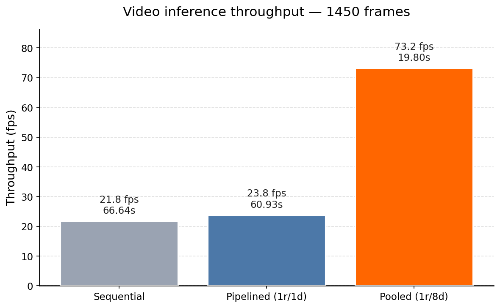

# 3x Faster Video Inference Without Touching the Model

Sometimes computer vision model inference runs so fast that it is not even close to being the bottleneck. Let's discuss an inference of D-FINE "s" model on a video, where the bottlenecks are and how to speed things up. I'll share some concepts and code. All experiments were run within the D-FINE-seg framework and can be reproduced. Check out [D-FINE-seg](https://github.com/ArgoHA/D-FINE-seg) repo for that, specifically [this script](https://github.com/ArgoHA/D-FINE-seg/blob/main/paper_assets/src/video_inference_bench.py). Note that I use D-FINE just as example, but talk about a generic approach that can be applied to other models.

## The setup

Hardware: Intel i5 12400f (6 physical cores / 12 logical threads), NVIDIA RTX 5070ti (16gb).
Model: D-FINE, "s" variant, fine-tuned on a custom dataset with 1 class, then exported to TensorRT with half precision, batch size 1.
Test video: 1 minute long, 3840x2160.

Using the existing inference class from the repo I am going to run TensorRT model on the video, then draw bboxes and save the drawn frame to the disk.

## Naive approach

Just sequentially read the frame -> inference the model -> draw bboxes and save to the disk. Simple, minimum code written, but not very efficient. See, while we are reading the frame or drawing bboxes - our GPU is not doing anything, that is not optimal.

``` python
def run_base(model, visualizer, source, save_dir: Path, max_frames: int | None = None) -> int:
    save_dir.mkdir(parents=True, exist_ok=True)
    cap = open_capture(source)
    pbar = tqdm(total=total_frames(cap, max_frames))
    n = 0
    try:
        while True:
            ok, frame = cap.read()
            if not ok:
                break
            res = model(frame)[0]
            drawn = visualizer.draw(frame, res)
            cv2.imwrite(str(save_dir / f"{n:06d}.jpg"), drawn)
            n += 1
            pbar.update(1)
            if max_frames and n >= max_frames:
                break
    finally:
        cap.release()
        pbar.close()
    return n
```

Let's do some simple profiling to get the numbers:

| stage   | ms/frame | max fps |
|---------|---------:|--------:|
| decode  |    10.72 |    93.3 |
| infer   |     2.10 |   476.2 |
| draw    |    15.45 |    64.7 |
| imwrite |    23.26 |    43.0 |

Now, if we run the naive approach and run everything sequentially, we should get 10.7 (decode) + 2.1 (infer) + 38.7 (draw + imwrite) = 51ms or ~20 fps. In fact I get 21.8 fps (see table below).

| run        | frames | time (s) |  fps |
|------------|-------:|---------:|-----:|
| Sequential |   1450 |    66.64 | 21.8 |

Hardware usage: GPU util - 3%, CPU util - 160% (less than one full physical core).

Note: Isn't it cool that model inference is so much faster than preprocessing and postprocessing?

## Optimization v1

As I mentioned, the baseline (naive approach) has everything running sequentially. We can do better:

1. Read frames in a separate thread. Put them into a frames queue.
2. Main loop - inference the model popping the oldest frame from the frames queue. Then put the results (bboxes, labels, scores) and the original frame to a drawing queue.
3. Draw and save in another thread - pop the oldest frame + results and do the postprocessing.

``` python
def run_optimized(model, visualizer, source, save_dir: Path, max_frames: int | None = None) -> int:
    """
    Reader thread -> main inference -> drawer thread.
    Drawer also writes the rendered frame to disk.
    Pipeline rate = max(decode, infer, draw + imwrite).
    """
    save_dir.mkdir(parents=True, exist_ok=True)
    cap = open_capture(source)

    read_q: Queue = Queue(maxsize=2)
    draw_q: Queue = Queue(maxsize=2)
    SENTINEL = None

    def reader():
        i = 0
        while True:
            ok, frame = cap.read()
            if not ok:
                break
            read_q.put((i, frame))
            i += 1
            if max_frames and i >= max_frames:
                break
        read_q.put(SENTINEL)

    def drawer_loop():
        while True:
            item = draw_q.get()
            if item is SENTINEL:
                break
            i, frame, res = item
            drawn = visualizer.draw(frame, res)
            cv2.imwrite(str(save_dir / f"{i:06d}.jpg"), drawn)

    t_r = Thread(target=reader, daemon=True)
    t_d = Thread(target=drawer_loop, daemon=True)
    t_r.start()
    t_d.start()

    pbar = tqdm(total=total_frames(cap, max_frames))
    n = 0
    try:
        while True:
            item = read_q.get()
            if item is SENTINEL:
                break
            i, frame = item
            res = model(frame)[0]
            draw_q.put((i, frame, res))
            n += 1
            pbar.update(1)
        draw_q.put(SENTINEL)
        t_r.join()
        t_d.join()
    finally:
        cap.release()
        pbar.close()
    return n
```

Let's call this approach "pipelined". This way the overall latency in theory will be the single slowest part of the system. From the profiling it should be draw + imwrite part, which is 38.7ms or 26 fps. In fact - 23.8 fps.

| run               | frames | time (s) |  fps |
|-------------------|-------:|---------:|-----:|
| Sequential        |   1450 |    66.64 | 21.8 |
| Pipelined (1r/1d) |   1450 |    60.93 | 23.8 |

Hardware usage: GPU util - 3%, CPU util - 200% (a full core).

## Optimization v2

Now, we still get low GPU and CPU utilization and still can do better. This time we just need to throw more CPU cores and we can do it on the postprocessing part (drawing and saving). The logic is very similar to what we had above, but this time we create N workers for the postprocessing (each pulling from the same drawing queue). The worker count is derived from `os.cpu_count()`, which on Linux/macOS returns logical cores including SMT threads — so on a 6c/12t CPU we get `int(12 * 0.8) - 1 = 8` drawers.

``` python
def run_optimized_v2(
    model,
    visualizer,
    source,
    save_dir: Path,
    max_frames: int | None = None,
    cpu_frac: float = 0.8,
    n_draw: int | None = None,
) -> int:
    """
    Pooled drawing:
      - 1 reader thread (VideoCapture is serial)
      - main thread runs inference and dispatches to drawers
      - n_draw worker threads draw and imwrite in parallel
    n_draw is derived from os.cpu_count(), which on Linux/macOS counts logical
    (SMT) threads — on a 6c/12t CPU this gives 8 drawers at cpu_frac=0.8.
    """
    if n_draw is None:
        n_draw = max(1, int((os.cpu_count() or 4) * cpu_frac) - 1)
    save_dir.mkdir(parents=True, exist_ok=True)

    cap = open_capture(source)
    read_q: Queue = Queue(maxsize=2 * n_draw + 2)
    draw_q: Queue = Queue(maxsize=2 * n_draw + 2)
    READ_DONE = object()
    DRAW_DONE = object()

    def reader():
        i = 0
        while True:
            ok, frame = cap.read()
            if not ok:
                break
            read_q.put((i, frame))
            i += 1
            if max_frames and i >= max_frames:
                break
        read_q.put(READ_DONE)

    def drawer():
        while True:
            item = draw_q.get()
            if item is DRAW_DONE:
                return
            i, frame, res = item
            drawn = visualizer.draw(frame, res)
            cv2.imwrite(str(save_dir / f"{i:06d}.jpg"), drawn)

    t_r = Thread(target=reader, daemon=True)
    drawers = [Thread(target=drawer, daemon=True) for _ in range(n_draw)]
    t_r.start()
    for t in drawers:
        t.start()

    pbar = tqdm(total=total_frames(cap, max_frames))
    n = 0
    try:
        while True:
            item = read_q.get()
            if item is READ_DONE:
                break
            i, frame = item
            res = model(frame)[0]
            draw_q.put((i, frame, res))
            n += 1
            pbar.update(1)
        for _ in drawers:
            draw_q.put(DRAW_DONE)
        for t in drawers:
            t.join()
        t_r.join()
    finally:
        cap.release()
        pbar.close()
    return n
```

| run               | frames | time (s) |  fps |
|-------------------|-------:|---------:|-----:|
| Sequential        |   1450 |    66.64 | 21.8 |
| Pipelined (1r/1d) |   1450 |    60.93 | 23.8 |
| Pooled (1r/8d)    |   1450 |    19.80 | 73.2 |



Hardware usage: GPU util - 12%, CPU util - 1000% (10 logical threads — i.e. 5 physical cores fully utilized via SMT).

Nice, now we are finally hardware bottlenecked with our CPU. And we have more than 3x speed increase!

I also tried a multiprocessing variant of the pooled approach. Even with shared memory for the frames, it topped out at 53 fps — slower than the threaded pool. The function is left in the script if you want to experiment with it.

## Segmentation variant

Same idea, now segmentation model. Visualization part is now a lot heavier because of blending masks.

per-stage profile over 200 frames:

| stage   | ms/frame | max fps |
|---------|---------:|--------:|
| decode  |    10.57 |    94.6 |
| infer   |     3.74 |   267.6 |
| draw    |   230.31 |     4.3 |
| imwrite |    22.83 |    43.8 |

And here are all three inference approaches:

| run               | frames | time (s) |  fps |
|-------------------|-------:|---------:|-----:|
| Sequential        |   1450 |   370.92 |  3.9 |
| Pipelined (1r/1d) |   1450 |   367.16 |  3.9 |
| Pooled (1r/8d)    |   1450 |    68.49 | 21.2 |

Note that pipelined is essentially identical to sequential here. With one drawer, the pipeline rate is bounded by the slowest stage, and `draw` (230 ms) dominates the next stage by ~16x — there is simply nothing to overlap with. Pooled (1r/8d) is the only thing that helps, because we are now parallelizing the dominant stage itself.

## TL:DR

Model serving is not just the forward pass - preprocessing and postprocessing often cost more. With a few hundred lines of threading and a pooled drawer stage, I got a 3x speedup on detection and a 5x speedup on segmentation, simply by making sure the CPU and GPU were never idle at the same time.

Three approaches shown: sequential (~ sum of all step latencies), pipelined (~ slowest step), pooled (~ slowest step / N workers)
